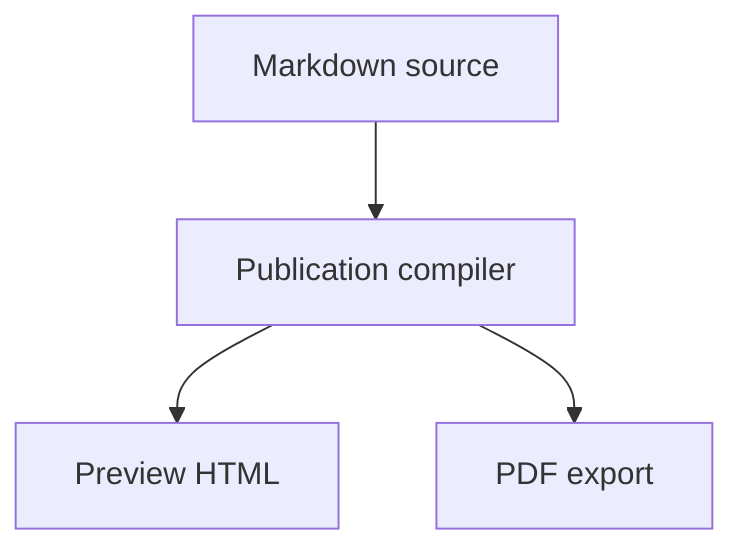
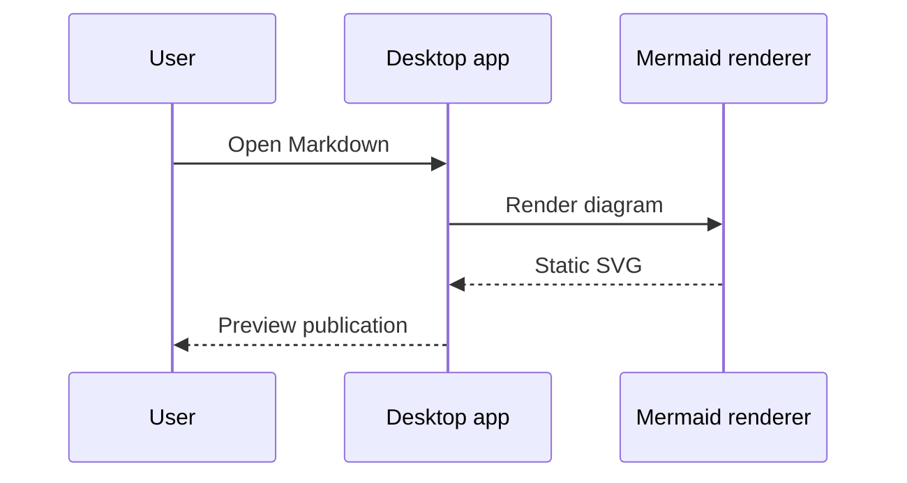
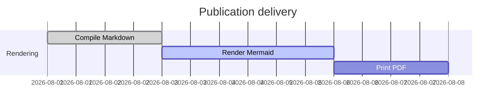
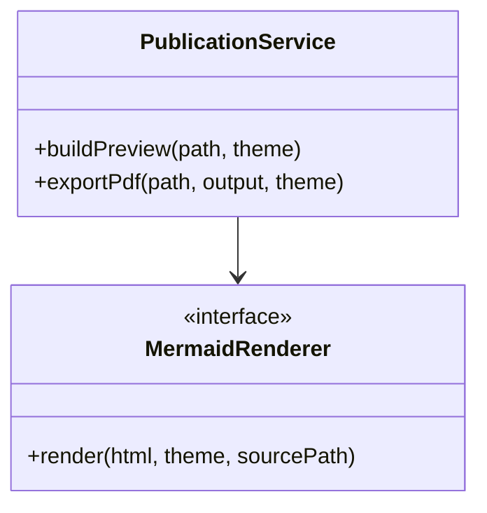

# Rendering diagnostics

This fixture isolates formula fonts, delimiter sizing, and Mermaid SVG layout.

## KaTeX

Inline formula: $E = mc^2$ and
$\left[\begin{smallmatrix}a & b\\c & d\end{smallmatrix}\right]$.

$$
\int_{-\infty}^{\infty} e^{-x^2}\,dx = \sqrt{\pi}
$$

$$
\begin{bmatrix}
a & b \\
c & d
\end{bmatrix}
\begin{bmatrix}
e & f \\
g & h
\end{bmatrix}
=
\begin{bmatrix}
ae + bg & af + bh \\
ce + dg & cf + dh
\end{bmatrix}
$$

$$
\sum_{i=1}^{n} i = \frac{n(n+1)}{2}
$$

## Flowchart

## Sequence diagram

## Gantt chart

## Class diagram

