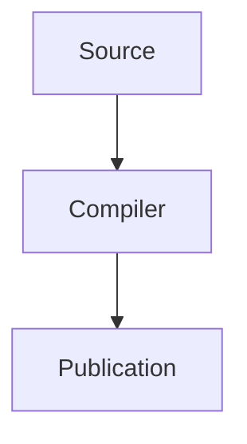

# Markdown Publication Studio

This is the first regression fixture for the publication pipeline. It contains a
local image, a table, and highlighted code.


## A practical example

The source remains plain Markdown while the publication renderer owns layout,
print CSS, and page configuration.

```typescript
export function publish(title: string): string {
  return `Publishing: ${title}`;
}
```

| Stage        | Backend     |
| ------------ | ----------- |
| Markdown     | markdown-it |
| Highlighting | Shiki       |

## Advanced rendering

Inline formula: $E = mc^2$.

$$
\int_0^1 x^2\,dx = \frac{1}{3}
$$

```rust
fn answer() -> u32 {
    42
}
```



<details>
<summary>Embedded static HTML</summary>

<div class="callout">This block is allowed because it is static HTML.</div>
</details>
| PDF          | Electron Chromium |
